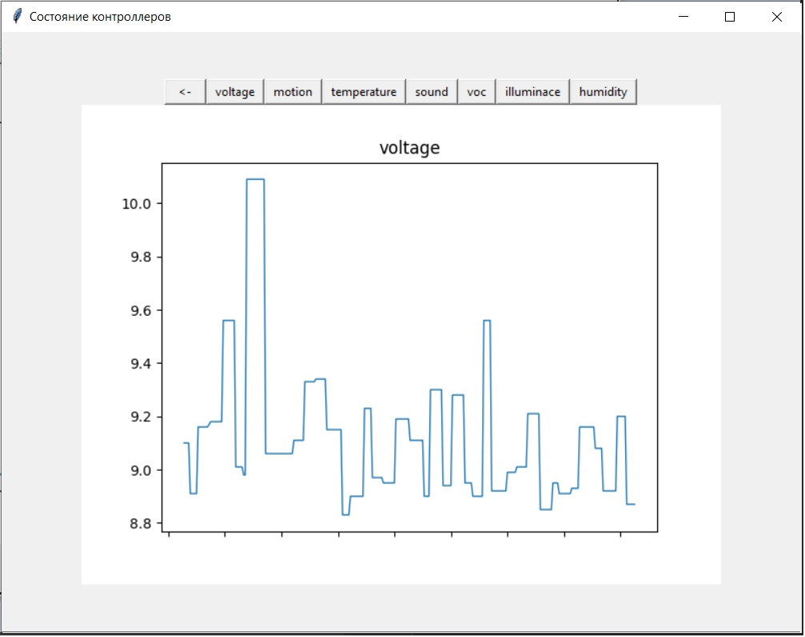

# Приложение для отслеживания состояния датчиков и их показаний
Данная программа предназначена для мониторинга состояния системы, а также отображения данных, полученных от датчиков.

## Описание работы интерфейса
При запуске программы на экране отображается стутус подкюченных контроллеров.

При наведении мышкой на состояние "Активного" контроллера отображается иннформация о его работе.

При нажатии на кнопку "Перейти к контроллеру" производится переход на новую страницу. Где отображется график работы "прошивки", 
то есть визуализация ее не критических отказов. 
Так же на данной странице присутсвуют кнопки для переключения графика на отображение показаний с соответсвующего датчика.

График показаний датчика напряжения. При нажатии на кнопку "<-" (назад) будет произведен переход на начальную страницу (состояние контроллеров).

## Описание работы системы
В системе присутвует 3 объекта: [Датчик](sensor.py), [Контроллер](controller.py), [Прошивка](firmware.py).

Объект "датчик" имитирует работу универсалььного датчика (возвращает значения различных показателей: влажность, температура и тд.)

Объект "контроллер" принимает данные от датчика, при этом возможно возникновение программного сбоя, который впоследствии будет обработан "прошивкой".

Объект "прошивка" обрабатывает даннные полученные от подключенных контроллеров, и предоставляет доступ сторонним приложениям для работы с данными.

С помощью API предоставляемого прошивкой данные отображаются в графическом виде.

## Установка и запуск приложения

Для установки и работы приложения необходимы файлы [Config_App.exe](https://github.com/Dima29koz/Application_Config/releases/download/v1.0/Config_App.exe), [dump-wb-3-052690.json](dump-wb-3-052690.json). Оба файла должны находится в одной дирректории.
